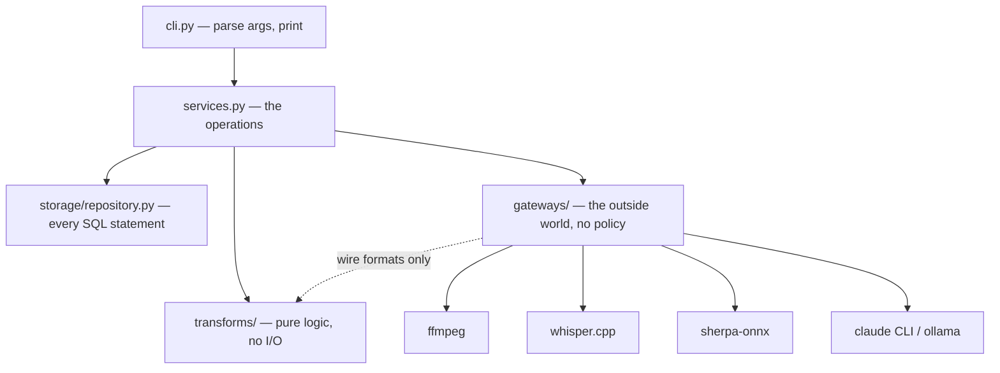

# voice-to-note

Turns a voice memo into structured notes without your audio leaving the machine:
ffmpeg normalises the recording, whisper.cpp transcribes it, sherpa-onnx works
out who spoke when, and an LLM pulls out a summary, action items and decisions
into SQLite. Everything is local except extraction, which uses the `claude` CLI
when you have one and otherwise a local Ollama model — with neither, transcription
and diarization still work and `vtn extract` can run later. Name a speaker once
and their voice is recognised in later memos.

## Quickstart

```sh
./run.sh                            # checks tools, builds whisper.cpp, fetches models
./run.sh process ~/memos/standup.m4a
```

`run.sh` is idempotent and forwards its arguments to `vtn` once setup is done.

| Command | What it does |
|---|---|
| `vtn process <file>` | convert, transcribe, diarize, store, extract notes |
| `vtn list` | list stored memos |
| `vtn show <id>` | print a memo's transcript |
| `vtn notes <id>` | print the extracted notes |
| `vtn extract <id>` | (re)run note extraction |
| `vtn diarize <id>` | (re)run diarization on a stored memo |
| `vtn ask <id> <question…>` | ask a question about one memo |
| `vtn rename <id> <label> <name>` | name a speaker; later memos match by voice |

Progress goes to stderr and results to stdout, so redirecting a command captures
only its output. `list`, `show` and `notes` also take `--json`:

```sh
vtn notes 3 --json | jq .action_items
```

Settings come from `VTN_*` environment variables or an optional `vtn.toml` in the
project root — environment wins, then the file, then the default. See `config.py`
for the full set (`whisper_model`, `num_speakers`, `ollama_model`, and others).

## Architecture

Every module is defined by what it is allowed to touch. Arrows are the imports
each layer may make; anything not drawn here is not allowed.



`cli.py` never queries the database and never formats a transcript — services
does both, so there is one place each output is built. Every layer may use the
dataclasses in `domain.py`. Data lives in `data/`: the SQLite database, and
converted audio under `data/uploads/`.

A `GatewayError` means a setup problem the user can fix, such as a missing binary
or model, and ends the command with a single line of advice. Anything else is a
bug and keeps its traceback, which is the only thing that locates it.

## Development

```sh
uv run pytest -q
uv run mypy src
uv run ruff check src tests
```

CI runs all three on every push, with a coverage floor of 84%.
